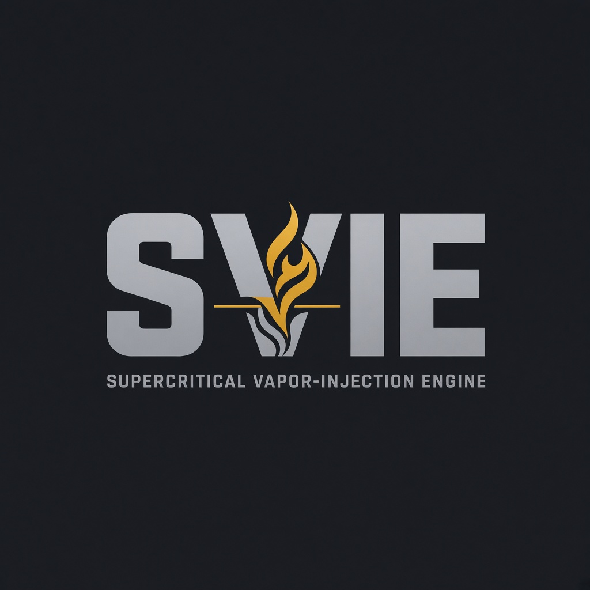

<p align="center">
  
</p>

<h1 align="center">SVIE</h1>

<p align="center">
  <strong>Supercritical Vapor-Injection Engine</strong><br/>
  Independent powertrain IP — runnable physics, machine specs, OEM portal
</p>

<p align="center">
  
  
  
  
  
  
  
  
  
</p>

<p align="center">
  <a href="https://theworker02.github.io/SVIE-concept/">Live demo</a> ·
  <a href="docs/LIVE-DEMO.md">Pages setup</a> ·
  <a href="docs/VIEWER-GUIDE.md">Viewer guide</a> ·
  <a href="docs/acquisition/VALUE-THESIS.md">Value thesis</a> ·
  <a href="Acquisition.md">Acquisition.md</a> ·
  <a href="docs/acquisition/EXECUTIVE-BRIEF.md">Executive brief</a> ·
  <a href="#quick-start">Quick start</a> ·
  <a href="#demo">Demo</a> ·
  <a href="docs/INDEX.md">Docs index</a> ·
  <a href="CHANGELOG.md">Changelog</a> ·
  <a href="brand/README.md">Brand</a>
</p>

---

## What this is

**SVIE** is a sellable OEM engineering package for supercritical flash fuel delivery, camless DEVA valvetrain architecture, and belt-free multi-ratio hybrid drives — delivered as code and specs, not slideware.

| Layer | Deliverable |
|-------|-------------|
| **Physics** | Python NumPy/SciPy models + CLI + FastAPI |
| **Specs** | YAML source-of-truth (~24 subsystem files) |
| **Proof** | Pytest golden vectors locking WOT / HEX / orifice / drive figures |
| **Docs** | SAE-style white paper, Honda comparative teardown, claim charts |
| **Portal** | Next.js calculators, architecture browser, guided **Demo** |
| **Brand** | Official logo + wordmark |

> Concept engineering baseline — **not** dyno-validated. Intended for OEM / Tier-1 technical review and strategic acquisition diligence. See [`Acquisition.md`](Acquisition.md).

---

## Architecture

```text
┌─────────────────────────────────────────────────────────────┐
│                     SVIE monorepo v1.3.0                    │
├──────────────────┬──────────────────┬───────────────────────┤
│  specs/*.yaml    │  docs/*.md       │  brand/               │
│  (source of      │  diligence pack  │  logo + wordmark      │
│   truth)         │                  │                       │
├──────────────────┴──────────────────┴───────────────────────┤
│           packages/physics-engine (svie-physics)            │
│  models → CLI → FastAPI (:8000) → pytest golden vectors     │
├─────────────────────────────────────────────────────────────┤
│           packages/web-portal (@svie/web-portal)            │
│  Next.js 15 · /pitch · /demo · /diligence · /package · …   │
└─────────────────────────────────────────────────────────────┘
```

---

## Quick start

**Requirements:** Python 3.11+, Node.js 20+, npm.

### 1. Install physics engine & verify golden tests

```bash
python -m pip install -e "./packages/physics-engine[dev]"
python -m pytest packages/physics-engine/tests -v
```

### 2. Run the CLI demo + inventory (recommended first look)

```bash
python -m svie_physics.demo
python -m svie_physics.inventory
```

Walks supercritical WOT fuel flow → HEX recuperation → HEM orifice → AXIOM rubber-band index, then prints the full package inventory (specs, docs, licensing modules).

### 3. Start the API + engineering portal

```bash
# Terminal A — math API
npm run dev:api

# Terminal B — portal
npm install
npm run dev:portal
```

| Surface | URL |
|---------|-----|
| Portal home | http://localhost:3000 |
| **Acquisition pitch** | http://localhost:3000/pitch |
| **Guided demo** | http://localhost:3000/demo |
| **Diligence hub** | http://localhost:3000/diligence |
| Package map | http://localhost:3000/package |
| Calculators | http://localhost:3000/calculators |
| OpenAPI | http://127.0.0.1:8000/docs |

---

<a id="demo"></a>

## Demo

### Live site (GitHub Pages)

**https://theworker02.github.io/SVIE-concept/** — static OEM portal with autoplay `/demo` tour (no API required).  
Setup: [`docs/LIVE-DEMO.md`](docs/LIVE-DEMO.md) · workflow: `.github/workflows/pages.yml`

```bash
npm run build:pages   # static export → packages/web-portal/out
```

### A. Program (preferred for diligence)

```bash
python -m svie_physics.demo
# or: python -m svie_physics.demo --json
```

Prints locked baseline metrics with module provenance so reviewers can map each number to a pytest vector.

### B. Local demo site

With API + portal running, open **[/demo](http://localhost:3000/demo)** for the guided narrative with optional live API metrics.

---

## Repository layout

```text
Acquisition.md            OEM acquisition / diligence brief
docs/acquisition/         Executive brief, IP inventory, FAQ, handoff, risks
docs/INDEX.md             Master documentation map
CHANGELOG.md              Release notes
VERSION                   Semver stamp (1.3.0)
LICENSE / NOTICE / SECURITY.md
CITATION.cff              Citation metadata
brand/                    Official logo kit
docs/                     White paper, teardown, claim charts, subsystems
specs/                    YAML engines, injectors, drives + CATALOG.md
packages/
  physics-engine/         Python package `svie-physics`
  web-portal/             Next.js OEM portal
```

---

## Physics modules

| Domain | Module | CLI |
|--------|--------|-----|
| Air / fuel mass flow | `air_fuel` | `python -m svie_physics.air_fuel` |
| HEX recuperation | `heat_exchanger` | `python -m svie_physics.heat_exchanger` |
| HEM choked orifice | `hem_choked_flow` | `python -m svie_physics.hem_choked_flow` |
| Piezo pintle | `piezo_dynamics` | `python -m svie_physics.piezo_dynamics` |
| Resonant GaN driver | `piezo_driver` | `python -m svie_physics.piezo_driver` |
| Chassis torsion | `chassis_torsion` | `python -m svie_physics.chassis_torsion` |
| HERT expansion | `hert_expansion` | `python -m svie_physics.hert_expansion` |
| GDSA shift | `gdsa_shift` | `python -m svie_physics.gdsa_shift` |
| Gear map | `gear_map` | `python -m svie_physics.gear_map` |
| Breakthrough (CCD/DKIS) | `breakthrough` | `python -m svie_physics.breakthrough` |
| V8-HR architecture | `engine_architecture` | `python -m svie_physics.engine_architecture` |
| DEVA power | `deva_power` | `python -m svie_physics.deva_power` |
| H₂ combustion | `h2_combustion` | `python -m svie_physics.h2_combustion` |
| BOM cost | `bom_cost` | `python -m svie_physics.bom_cost` |
| CVT vs AXIOM | `cvt_comparison` | `python -m svie_physics.cvt_comparison` |
| AXIOM / e:HEV bridge | `axiom_drive` | `python -m svie_physics.axiom_drive` |
| NEXUS-48 budget | `nexus_48` | `python -m svie_physics.nexus_48` |
| SONIC NVH | `sonic_nvh` | `python -m svie_physics.sonic_nvh` |
| CHRONOS / SENTINEL | `chronos_sentinel` | `python -m svie_physics.chronos_sentinel` |
| BLEND / MIRAGE / VECTOR | `blend_mirage_vector` | `python -m svie_physics.blend_mirage_vector` |
| **Guided demo** | `demo` | `python -m svie_physics.demo` |
| **Package inventory** | `inventory` | `python -m svie_physics.inventory` |
| **Platform next-wave** | `platform_features` | `python -m svie_physics.platform_features` |
| **Manufacturing** | `manufacturing` | `python -m svie_physics.manufacturing` |
| **Validate** | `validate` | `python -m svie_physics.validate` |
| **Add-ons** | `addon_features` | `python -m svie_physics.addon_features` |

Root npm scripts:

```bash
npm run test:physics
npm run install:physics
npm run demo
npm run inventory
npm run dev:api
npm run dev:portal
npm run build:portal
```

---

## Documentation

| Document | Purpose |
|----------|---------|
| [Validation report](docs/validation-report.md) | Measured + literature status |
| [Addon features](docs/addon-features.md) | Dry sump / EGR / mounts / RE / KERS |
| [Manufacturing master](docs/manufacturing-master-plan.md) | Process routes for engine/trans/body |
| [Engine next wave](docs/engine-next-wave.md) | CRYO-RAIL / RING-ZERO / OIL-SPINE / AETHER |
| [Transmission next wave](docs/transmission-next-wave.md) | FLUX-SHIFT / GEAR-MESH-AM / JET |
| [Body platform](docs/body-platform.md) | NODE-CAST / AERO / CELL / THERMAL |
| [Viewer guide](docs/VIEWER-GUIDE.md) | Timed paths for first-time viewers |
| [Value thesis](docs/acquisition/VALUE-THESIS.md) | Why acquire / valuation framing |
| [Competitive matrix](docs/acquisition/COMPETITIVE-MATRIX.md) | Public competitive matrix |
| [Acquisition.md](Acquisition.md) | Diligence, asset inventory, deal structures |
| [Executive brief](docs/acquisition/EXECUTIVE-BRIEF.md) | One-page leadership thesis |
| [IP inventory](docs/acquisition/IP-INVENTORY.md) | Asset register + SPA exhibits |
| [FAQ](docs/acquisition/FAQ.md) | Diligence Q&A |
| [OEM handoff](docs/acquisition/OEM-HANDOFF.md) | Post-close integration |
| [Hardware roadmap](docs/acquisition/HARDWARE-ROADMAP.md) | TRL-4→6 gates |
| [Risk register](docs/acquisition/RISK-REGISTER.md) | Known risks |
| [Docs index](docs/INDEX.md) | Full map |
| [Spec catalog](specs/CATALOG.md) | 24 YAML SoT |
| [Technical white paper](docs/whitepaper.md) | Engineering narrative |
| [Honda Earth Dreams / VTEC teardown](docs/honda-e-hev-teardown.md) | Comparative baseline |
| [Claim charts](docs/claim-charts.md) | Proposed claim map |
| [Chassis structural](docs/chassis-structural.md) | Torsion / stress nodes |
| [HERT-12 transaxle](docs/hert-transaxle.md) | Expansion machine |
| [Breakthrough features](docs/breakthrough-features.md) | CCD / CASMIR / PSI |
| [SVIE-V8-HR architecture](docs/svie-v8-hr-architecture.md) | High-RPM H₂ DI V8 |
| [DEVA valvetrain](docs/deva-valvetrain.md) | Camless actuation |
| [H₂ combustion control](docs/h2-combustion-control.md) | DI / knock / λ |
| [Thermal + BOM](docs/thermal-bom.md) | HEX + cost envelope |
| [CVT evidence dossier](docs/cvt-evidence-dossier.md) | Slip / TSB literature |
| [AXIOM anti-CVT](docs/axiom-anti-cvt.md) | Belt-free drive thesis |
| [Honda R&D gap map](docs/honda-rd-gap-map.md) | Public-gap analysis |
| [NEXUS / SONIC / CHRONOS](docs/nexus-sonic-chronos.md) | Ops / NVH / TRL |
| [BLEND / MIRAGE / VECTOR](docs/blend-mirage-vector.md) | Control layer |

---

## WOT baseline snapshot (golden-locked)

| Metric | Value |
|--------|-------|
| Displacement (5.2 L family) | 5.204 L |
| Peak target | ≈ 700 hp @ 8500 |
| ṁ fuel | **28.28 g/s** |
| Q̇ HEX | **23.2 kW** |
| Exhaust recovery | ≈ 6.2% |
| A_o required / max | 0.431 / 0.630 mm² |
| Piezo drive (raw) | 16.88 W/valve |
| Target BTE | 48–52% (**unvalidated**) |
| AXIOM rubber-band index | **0** (no belt) |

---

## Brand

Official mark and wordmark live in [`brand/`](brand/). Palette: graphite `#12151A`, ink `#E8ECF1`, amber `#D4A017`, steel `#7A8A9A`.

---

## Versioning

Current release: **1.3.0** (see [`VERSION`](VERSION), [`CHANGELOG.md`](CHANGELOG.md)).

Semantic intent for this package:

- **MAJOR** — breaking physics API or invalidated golden contracts  
- **MINOR** — new subsystems / acquisition surfaces (this release)  
- **PATCH** — docs, portal polish, non-breaking fixes  

---

## License & acquisition

Proprietary — see [`LICENSE`](LICENSE). For OEM licensing or purchase process, start with [`Acquisition.md`](Acquisition.md).

**SVIE** — independent advanced powertrain engineering research.
